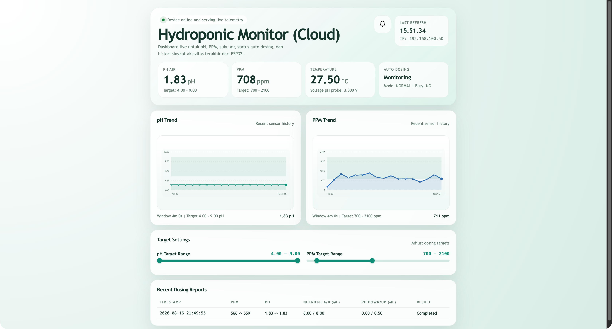

<div align="center">

# 💧 HiDrop — Smart Hydroponic Controller

**ESP32-based IoT hydroponic system with real-time monitoring, auto-dosing, Firebase integration, and OTA firmware updates.**

[](https://github.com/alifsyr/HiDrop/actions/workflows/release.yml)
[](https://platformio.org)
[](https://www.espressif.com/en/products/socs/esp32)
[](LICENSE)



[Features](#-features) · [Hardware](#-hardware--wiring) · [Getting Started](#-getting-started) · [API Reference](#-api-reference) · [Serial Commands](#-serial-commands) · [Architecture](#-architecture)

</div>

---

## ✨ Features

| Category | Details |
|---|---|
| **Sensor Monitoring** | TDS (PPM), pH, and water temperature via DS18B20 |
| **Auto-Dosing** | Automatic nutrient A+B, pH Up/Down pump control |
| **Display** | 20×4 LCD with split layout — sensors left, farm info right |
| **Web Dashboard** | Cloud web UI hosted on GitHub Pages with live charts |
| **Firebase** | Real-time sync, remote command, and OTA trigger via RTDB |
| **OTA Updates** | Firmware update via GitHub Releases or Firebase-triggered URL |
| **WebSerial** | Browser-based serial monitor and command interface |
| **NTP Clock** | WIB (UTC+7) time sync over Wi-Fi |
| **EEPROM Persistence** | pH and PPM targets survive reboots |
| **Google Sheets Logging** | Dosing event logging via Apps Script (optional) |
| **Dev Mode** | Safe development mode with auto-dosing disabled |

---

## 🔧 Hardware & Wiring

### Bill of Materials

| Component | Description |
|---|---|
| ESP32 DevKit | Main microcontroller |
| TDS Sensor | Analog gravity-type TDS sensor |
| pH Sensor | Analog pH probe with transmitter |
| DS18B20 | 1-Wire waterproof temperature sensor |
| LCD 20×4 I2C | Display module (I2C, addr `0x27`) |
| 4-Channel Relay | Controls 4 peristaltic pumps |
| Peristaltic Pumps ×4 | Nutrient A, Nutrient B, pH Down, pH Up |

### GPIO Pin Map

| Function | GPIO |
|---|---|
| TDS Sensor (Analog) | `35` |
| pH Sensor (Analog) | `34` |
| DS18B20 Temperature | `4` |
| I2C SDA (LCD) | `21` |
| I2C SCL (LCD) | `22` |
| Relay — Nutrient A | `25` |
| Relay — Nutrient B | `26` |
| Relay — pH Down | `27` |
| Relay — pH Up | `33` |

---

## 🚀 Getting Started

### Prerequisites

- [PlatformIO IDE](https://platformio.org/install/ide?install=vscode) (VS Code extension) or PlatformIO Core CLI
- Python 3.x (required by PlatformIO)
- ESP32 board and all hardware components above

### 1. Clone the Repository

```bash
git clone https://github.com/alifsyr/HiDrop.git
cd HiDrop
```

### 2. Configure Environment Variables

Copy the example file and fill in your credentials:

```bash
cp .env.example .env
```

Edit `.env`:

```env
# Wi-Fi Credentials
WIFI_SSID=your_wifi_ssid
WIFI_PASSWORD=your_wifi_password

# Google Sheets Logging (optional)
GOOGLE_SHEETS_LOGGING_ENABLED=false
GOOGLE_SHEETS_WEB_APP_URL=
GOOGLE_SHEETS_SHARED_SECRET=
```

> **Important:** `.env` is in `.gitignore` and will **never** be committed. Do not rename it or commit credentials.

### 3. Build and Flash

```bash
# Build firmware
pio run

# Flash to ESP32 (connect via USB)
pio run -t upload

# Open serial monitor
pio device monitor -b 115200
```

After a successful Wi-Fi connection, the IP address of the dashboard is printed to the serial monitor:

```
WiFi Connected! IP Address: 192.168.1.50
```

Open `https://alifsyr.github.io/HiDrop/` in a browser to access the dashboard.
To access the local WebSerial monitor, open `http://<ESP32_IP>/webserial` (e.g. `http://192.168.1.50/webserial`).

---

## 📊 Default Targets

| Parameter | Default Range |
|---|---|
| pH | `5.8 – 6.2` |
| PPM (TDS) | `600 – 800` |

Targets can be changed at runtime via serial commands or WebSerial and are persisted to EEPROM.

---

## 🤖 Auto-Dosing Logic

The dosing controller reads sensors periodically and acts on these rules:

```
PPM < target_min  →  Nutrient A + B pumps run simultaneously
pH  > target_max  →  pH Down pump runs
pH  < target_min  →  pH Up pump runs
PPM > target_max  →  No automatic dilution (manual water change required)
```

After each dosing cycle, the system waits for a configurable **mixing delay** before rechecking sensors.

### LCD Status Codes

| LCD Display | Meaning |
|---|---|
| `NORMAL` | Monitoring only, no active dosing |
| `NUTRI A+B` | Nutrient dosing active or awaiting recheck |
| `PH ↓ DOSE` | pH Down dosing active or awaiting recheck |
| `PH ↑ DOSE` | pH Up dosing active or awaiting recheck |

---

## 🌐 Web Dashboard

The web dashboard is hosted on GitHub Pages and connects directly to the Firebase Realtime Database. 

**Dashboard URL:** `https://alifsyr.github.io/HiDrop/`

The dashboard allows you to:
- Monitor live sensors (pH, PPM, Temperature)
- View historical charts
- View recent dosing activity reports
- Trigger Over-The-Air (OTA) updates remotely
- Send target range configurations to the device

The ESP32 no longer serves the dashboard locally to save memory and improve performance. Instead, it only serves the WebSerial interface at `http://ESP32_IP/webserial`.

---

## 💬 Serial Commands

Commands can be sent via USB Serial Monitor (115200 baud) or through the **WebSerial** browser interface at `http://ESP32_IP/webserial`.

### Target Configuration

| Command | Description |
|---|---|
| `SET PH <min> <max>` | Set pH target range, e.g. `SET PH 5.8 6.2` |
| `SET PPM <min> <max>` | Set PPM target range, e.g. `SET PPM 600 800` |
| `SHOW TARGETS` | Print current targets to serial |
| `RESET TARGETS` | Restore default targets |

### Manual Dosing

| Command | Description |
|---|---|
| `DOSE NUTRI` | Trigger a manual nutrient A+B dosing cycle |
| `DOSE PH DOWN` | Trigger a manual pH Down dosing cycle |
| `DOSE PH UP` | Trigger a manual pH Up dosing cycle |

### TDS Calibration

| Command | Description |
|---|---|
| `ENTER` | Enter TDS calibration mode |
| `EXIT` | Exit TDS calibration mode |
| *(other)* | Forwarded to the `GravityTDS` library calibration handler |

### System

| Command | Description |
|---|---|
| `RESET WIFI` | Clear Wi-Fi settings and reboot (triggers Wi-Fi Manager captive portal) |
| `DEV STATUS` | Print dev mode info (only in DEV_MODE builds) |

---

## ☁️ Firebase Integration

HiDrop supports two-way communication with Firebase Realtime Database:

- **Telemetry push** — sensor readings, dosing state, and uptime are continuously synced to RTDB.
- **Remote commands** — target range changes (`SET PH`, `SET PPM`) can be pushed from the cloud.
- **OTA trigger** — a firmware update URL and version tag written to RTDB triggers the ESP32 to self-update over-the-air.

### OTA Firmware Update Flow

```
GitHub Push → CI Build → GitHub Release (.bin) → Firebase RTDB ← ESP32 polls
                                                         ↓
                                               ESP32 downloads & flashes
```

The CI/CD pipeline (`.github/workflows/release.yml`) automatically builds and publishes a release binary on every push to `main`/`master`. The binary version is tagged as `v1.0.<run_number>`.

---

## 🏗️ Architecture

```
src/
└── main.cpp                  # Entry point, setup & loop

include/
├── actuators/                # Relay / pump control
├── config/                   # App constants, pin definitions
├── control/                  # Dosing controller, sensor manager, target manager
├── display/                  # LCD display rendering
├── models/                   # Data structures (SensorData, DosingReport)
├── network/                  # WiFi/NTP, Firebase, Google Sheets, OTA
├── sensors/                  # TDS, pH, temperature sensor wrappers
└── utils/                    # Logger and shared utilities
```

### Key Libraries

| Library | Purpose |
|---|---|
| `ESPAsyncWebServer` | Async HTTP server for WebSerial |
| `WebSerial` | Browser-based serial terminal |
| `Firebase Arduino Client` | Firebase RTDB client |
| `DallasTemperature` / `OneWire` | DS18B20 temperature sensor |
| `LiquidCrystal_I2C` | I2C LCD display |
| `ArduinoJson` | JSON serialization |
| `ESPAsyncWiFiManager` | Captive portal for Wi-Fi provisioning |

---

## 🔁 CI/CD

Every push to `main` or `master` triggers the GitHub Actions workflow:

1. **Build** — PlatformIO compiles the firmware with version `1.0.<run_number>`
2. **Release** — A GitHub Release is created and `firmware.bin` is attached as an asset
3. **OTA** — The release binary can be referenced via Firebase to trigger remote device updates

---

## 🤝 Contributing

Contributions are welcome! Please open an issue or pull request.

1. Fork the repository
2. Create your feature branch: `git checkout -b feat/your-feature`
3. Commit your changes: `git commit -m 'feat: add your feature'`
4. Push to the branch: `git push origin feat/your-feature`
5. Open a Pull Request

---

## 📄 License

This project is licensed under the [MIT License](LICENSE).

---

<div align="center">
Made with ❤️ for smarter farming · <a href="http://alif-tech.my.id/">alif-tech.my.id</a>
</div>
